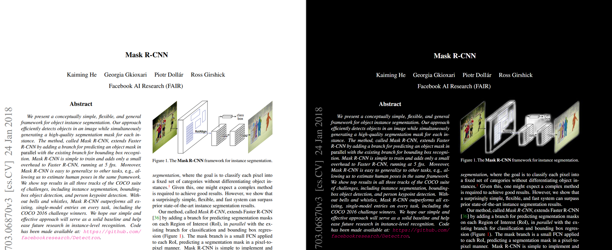
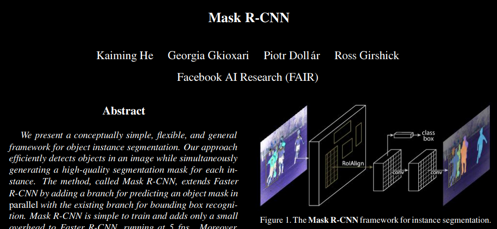
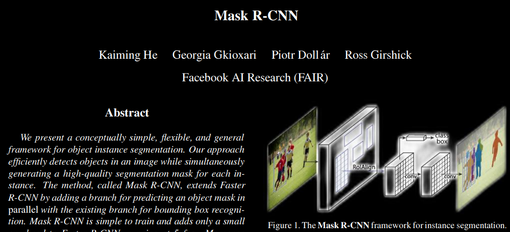

# PDF Darkmode

##  🗒️ Convert Paper to Darkmode!



## Install dependency
<<<<<<< HEAD
1. Install pdf2htmlEX [Ubuntu](https://github.com/pdf2htmlEX/pdf2htmlEX/releases)
 [Windows](https://soft.rubypdf.com/software/pdf2htmlex-windows-version)
2. Install [Chrome Browser](https://www.google.com/intl/ko/chrome/)

3. Create conda env
```
conda env create -f env.yaml
```
*Default is CPU based. if you want to use GPU, Please install [pytorch+cuda](https://pytorch.org/get-started/locally/)

## Configuration
```config.json
{
    "input_dir" : "./input/", // input pdf dir 
    "output_dir" : "./output/" // output pdf dir
    "adaptive_conversion" : false // adaptive conversion
}
```
### Adaptive Conversion
- **Non Adaptive**
    - Not use GPU, Fast and Simple conversion 

- **Adaptive**
    - Use GPU(or CPU) for [rembg](https://github.com/danielgatis/rembg), Use some time and Keep Image on paper
    - eg. 1.1 page/sec on  AMD Ryzen™ 5 5600X
    - eg. 1.8 page/sec on RTX3060



## Run script
```
conda activate pdf
python convert.py
```
